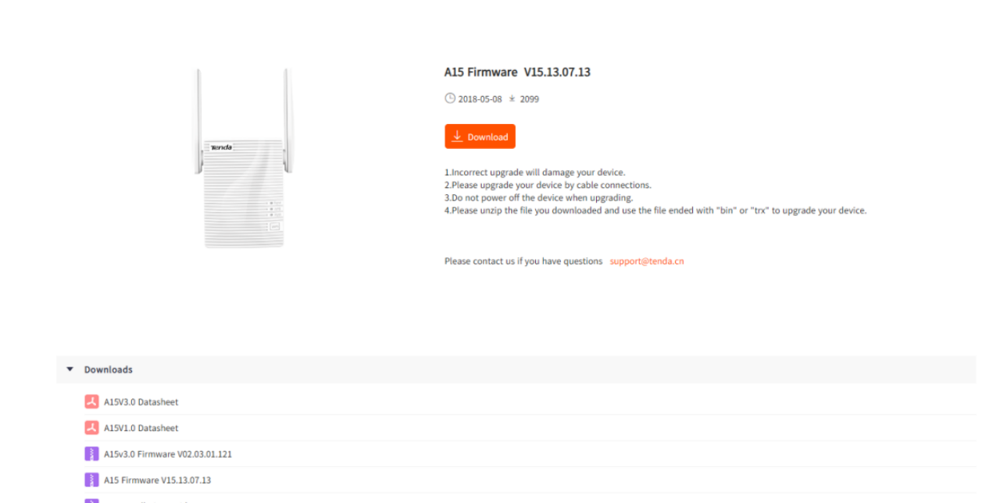
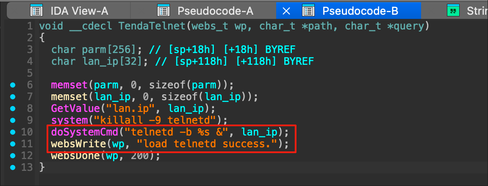
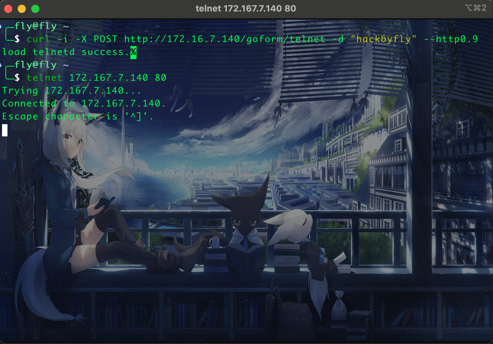

# Tenda A15 V15.13.07.13 TendaTelnet Backdoor Vulnerability

Vulnerability description: Tenda A15 V15.13.07.13 was found to have a backdoor vulnerability at /goform/telnet.

Firmware Download: https://www.tendacn.com/download/detail-3187.html

### 1.lan_ip

#### Vulnerability analysis

I originally planned to hunt for vulnerabilities related to command injection, but accidentally discovered a backdoor vulnerability in the TendaTelnet function. 

In the TendaTelnet function, the value of lan_ip is first obtained from the configuration file, then all telnetd processes are killed, and a telnet service is opened for the router ip.

function call chain main()-->initWebs()-->formDefineTendDa()-->TendaTelnet()

#### Payload

History is always astonishingly similar. 

If you don't have any ideas, go flip through CVE and there will be surprises. 

Pick a hole for nothing🤣🤣🤣 .

  
